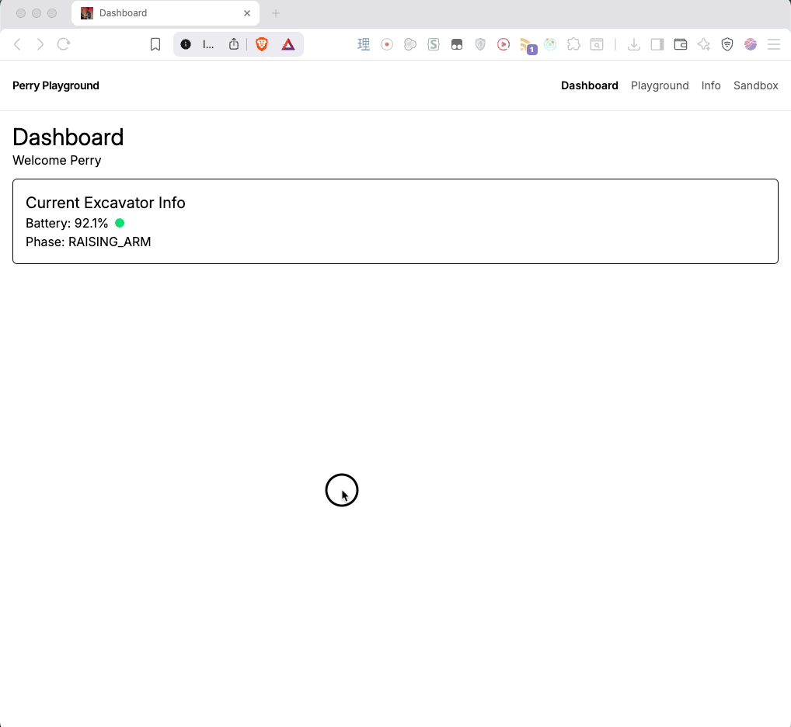

# Practice Project 

I'm using this project to prep my Redux Toolkit and Three.js knowledge using dummy telemetry data coming through web sockets

## Image



## Commands

```sh
## frontend
npm run dev
## backend which provides real time dunny data via websocket
node websocket-server/index.mjs
```
